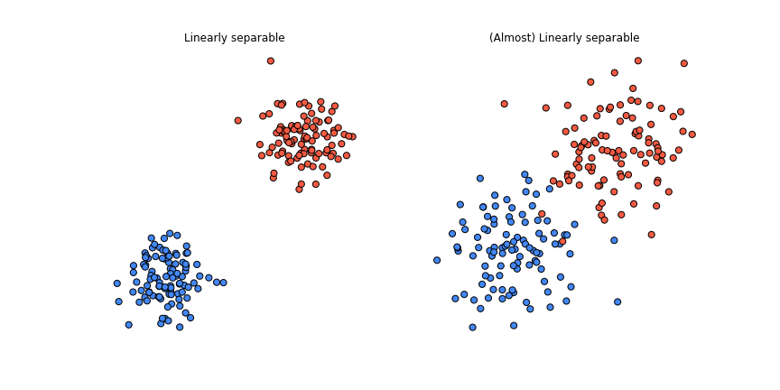
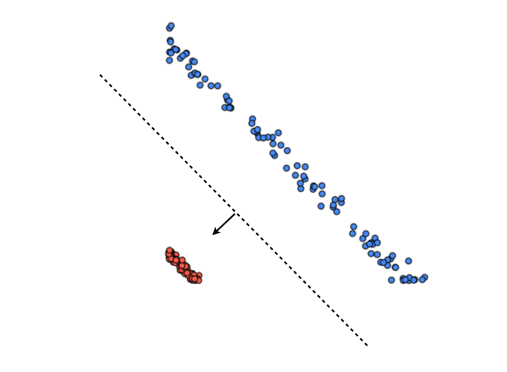
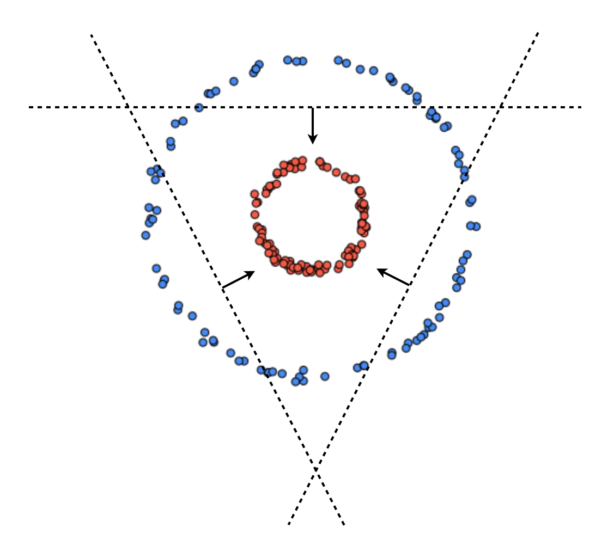
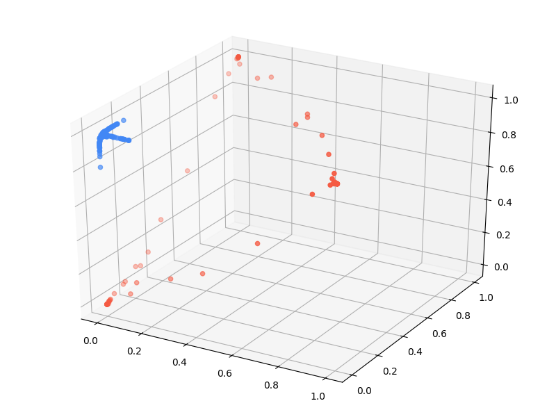
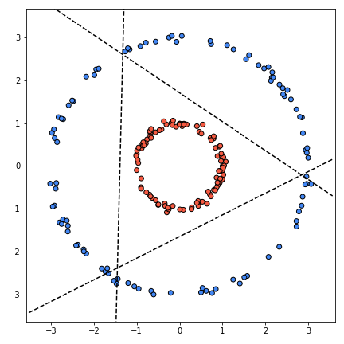

- *This post is best suited for people who are familiar with linear classifiers, specifically Logistic Regression*

- *For the entirety of this post I will be assuming binary classes but everything that I write here can be extended to multi-class problems*

There are many types of neural networks, each having some advantage over others. In this post I want to introduce the simplest form of a neural network, a Multi-Layer Perceptron (MLP). MLPs are a powerful method for approximating functions and it's a relatively simple model to implement.

Before we jump into talking about MLPs, let's quickly go over linear classifiers. Given training data as pairs $$(\boldsymbol{x}_i, y_i)$$ where $$\boldsymbol{x}_i \in \mathbb{R}^n$$ are our datapoints (observations) and $$y_i \in \{0, 1\}$$ are their corresponding class labels. The goal is to learn a vector of weights $$\boldsymbol{w}$$ and a bias $$b$$ such that $$\boldsymbol{w}^T\boldsymbol{x} + b \ge 0$$ if $$\boldsymbol{x}$$ belongs to the positive class and $$\boldsymbol{w}^T\boldsymbol{x} + b < 0$$ otherwise (belongs to negative class). This decision can be written as the following step function:

$$\text{Prediction} = \begin{cases}
      1 & \boldsymbol{w}^T\boldsymbol{x} + b \ge 0 \\
      0 &  \text{Otherwise}\\
\end{cases}$$

In the case of Logistic Regression the decision function is characterized by the sigmoid function $$\sigma(z) = \frac{1}{1+e^{-z}}$$ where $$z = \boldsymbol{w}^T\boldsymbol{x} + b$$

$$\text{Prediction} = \begin{cases}
      1 & \sigma(z) \ge \theta \\
      0 &  \text{Otherwise}\\
\end{cases}$$

Where $$\theta$$ is usually set to be 0.5.

*Note: These are actually just a couple of examples of a zoo of functions that people in deep learning literature refer to as Activation functions.*

If the dataset is linearly separable this is all fine, since we can always learn $$\boldsymbol{w}$$ and $$b$$ that separates the data perfectly. We're good even if the dataset is almost linearly separable, i.e the data points can be separated with a line, barring a few noisy observations.  

But what can we do if the dataset is highly non-linear? For example something like this:

One thing we could potentially do is to come up with some non-linear transformation function $$\phi(\boldsymbol{x})$$ such that the data becomes linearly separable. We can then apply that transformation to the original dataset and learn a linear classifier on the transformed dataset.

For example in this case we can see that the data points come from two co-centric circles. We can use this information to come up with a function: $$\phi(\boldsymbol{x}) = [x_1^2, x_2^2]$$

Now we can learn a vector $$\boldsymbol{w}$$ and bias $$b$$ such that $$\boldsymbol{w}^T\phi(\boldsymbol{x}) + b \ge 0$$ if $$\boldsymbol{x}$$ is positive and $$\boldsymbol{w}^T\phi(\boldsymbol{x}) + b < 0$$ otherwise.

This works, but what can we do when it's not obvious what the underlying function is? What if we're working in high dimensions where we can't visualize the shape of the dataset? In general it's hard to come up with these transformation functions.

Here's another idea, instead of learning one linear classifier let's try to learn three linear classifiers and then combine them to get something like this:

We know how to learn a single linear classifier but how can we learn three linear classifiers that can produce a result like this? The naive approach would be to try to learn them independently using different random initializations and hope that they converge to something like what we want. But this approach is doomed from the beginning since each classifier will try to fit the whole data while ignoring what the other classifiers are doing. In other words there will be no cooperation since none of the classifiers will be 'aware' of each other. This is the opposite of what we want. We want/need the classifiers to work together.

This is where MLPs come in. A two-layer MLP can actually do both of the aforementioned things. It can learn a non-linear transformation that makes the dataset linearly separable and it can learn multiple linear classifiers that cooperate.

<!-- **Neural Networks:**

By far the most common way of introducing neural networks is with the notion of computational graphs. While I do think that computational graphs are an important concept to understand, I do not think that they are the best way to be introduced to neural networks. Instead I will be using concepts that hopefully you the reader are familiar with. These are the essential operations for neural networks: matrix multiplication, non-linear activation functions and function composition. -->

<!-- In general it's better to teach new ideas using concepts and terms that a person is already familiar with, since this allows for the already known things to function as a foundation to be built on, rather than trying build from scratch.

The term 'neural networks' itself is kind of misleading. It creates an image of a brain like structure and it feeds into the whole hype about AI taking over. Neural networks in reality are nothing but a chain of matrix multiplications followed by non-linear functions.   -->

**First Layer**

A layer in the context of an MLP is nothing but a linear transformation followed by an activation function. We will use our idea of learning multiple classifiers but instead of looking at them independently, we'll define them together as a single layer.

Let's define three classifiers $$(\boldsymbol{w_1}, b_1), (\boldsymbol{w_2}, b_3)$$ and $$(\boldsymbol{w_3}, b_3)$$. For compactness, let's combine all of the weights into a single matrix and all of the biases into a vector.

$$\boldsymbol{W} = \begin{bmatrix}
           \boldsymbol{w_1} \\
           \boldsymbol{w_2} \\
           \boldsymbol{w_3} \\
         \end{bmatrix} = \begin{bmatrix}
                    w_1^{(1)} & w_1^{(2)}\\
                    w_2^{(1)} & w_2^{(2)}\\
                    w_3^{(1)} & w_3^{(2)}\\
                  \end{bmatrix} \boldsymbol{b} = \begin{bmatrix}
                             b_1 \\
                             b_2 \\
                             b_3 \\
                           \end{bmatrix}$$

Now we need to get the classification decision from all three classifiers. We might be tempted to use the step function but for technical reasons, that will become clear later on, we require the function to be differentiable and since the step function is not, we cannot use it. We could however use the sigmoid.

The classification decision from each of the classifiers can then be obtained by applying $$\sigma$$ element-wise to each of the three outputs.

$$\sigma(\boldsymbol{Wx} + \boldsymbol{b}) = \begin{bmatrix}
\sigma(\boldsymbol{w_1x} + b_1) \\
\sigma(\boldsymbol{w_2x} + b_2) \\
\sigma(\boldsymbol{w_3x} + b_3) \\
\end{bmatrix}$$

Notice that what we have is a linear transformation $$\boldsymbol{s} = \boldsymbol{Wx} + \boldsymbol{b}$$, followed by a non-linear activation $$\boldsymbol{h} = \sigma(\boldsymbol{s})$$.

*In the neural network lingo what we defined above is a hidden layer with 3 sigmoid units. Note that we need not use sigmoid here. As I mentioned in the beginning of this post, the sigmoid function is just one example of many activation functions. We could use anything we want (as long as it's differentiable). Here are a few alternatives: Tanh, ReLu, LeakyReLu etc. The most popular choice in practice is the ReLu activation defined as $$\max(0, x)$$.*

**Second Layer**

The first layer gives us outputs from the classifier but we still need a way to combine them into one final classification decision. For example if the outputs from the layer are $$[0.7, 0.6, 0.1]$$ what should the classification decision be?

Let's define another classifier $$(\boldsymbol{w}_{final}, b_{final})$$ that will take the outputs of the three classifiers as input and will produce a final output: $$\boldsymbol{w}_{final}^T\sigma(\boldsymbol{Wx} + \boldsymbol{b}) + b_{final}$$

And finally in order to get the final classification decision, we apply a sigmoid activation to the result of this as well. Combining all the parts we get that our function is defined as:

 $$\text{MLP}(x) =\sigma(\boldsymbol{w}_{final}^T\sigma(\boldsymbol{Wx} + \boldsymbol{b}) + b_{final})$$

This one line actually fully defines our two-layer MLP.

**Why do we need activations?**

When I defined the first layer, I said that we needed to get a classification decision from each of the classifiers. This isn't quite right. We don't need a classification decision. What we actually need is a response. A response that is non-linear in the input. Non-linear activation functions are actually what makes this whole thing work. If for example in our hidden layer we removed the $$\sigma$$ activation and replaced it with an identity, the MLP will actually become a linear classifier which would mean that we will not be able represent the non-linear shape of the input data. To convince yourself, write out the MLP without any activations and see that it reduces to a linear function.

<!-- **More layers**

In practice we usually have many such layers each connected to each other, i.e the output of one becomes the input for to next one. Chaining layers like this is actually the same as function composition. If we define each layer as a function, $$f_i(x) = g(\boldsymbol{W}_i\boldsymbol{x}+b_i)$$, where $$g$$ is some non-linear activation then an n-layer MLP can be written as the function composition $$MLP(x) = f_n(f_{n-1}(...(f_1(x))) $$. The depth of a network corresponds to $$n$$, when $$n > 2$$, people refer to this network as deep (this is where the term deep learning comes from). The width of a network corresponds to the number of units in each of the layer.

The functions $$f_1,f_2, ..., f_{n-1}$$ are all learning a transformations with the ultimate goal to make the input $$X$$ linearly separable for the final layer $$f_n$$. This is the essence of deep learning. Every neural network one way or another is trying to learn a transformation function on the input space that can render the data linearly separable. -->

**Learning**

We have managed to define a two-layer MLP but we still need a way to learn the parameters of the function. The entire function is fully differentiable and this is no accident. As I said earlier, we refrained from using the step-function as an activation since it's not differentiable. We needed everything to be differentiable because we want to use Stochastic Gradient Descent (SGD) to learn the parameters of the function. And as you know SGD works by repeatedly taking the gradient of the objective function w.r.t learnable parameters and taking a step in the direction of the steepest descent.

**Result**

I want to skip ahead a little bit and show what the result will be after learning the parameters. Going back to how we started, we said that if we had a transformation function that could make the dataset linearly separable then learning would be easy. Well $$\phi(\boldsymbol{x}) = \sigma(\boldsymbol{Wx} + \boldsymbol{b})$$ will actually be that transformation that makes the dataset linearly separable. This is what the data looks like after applying that learned function:

And these are the three linear classifiers that are learned in the hidden layer:

pretty neat huh?
