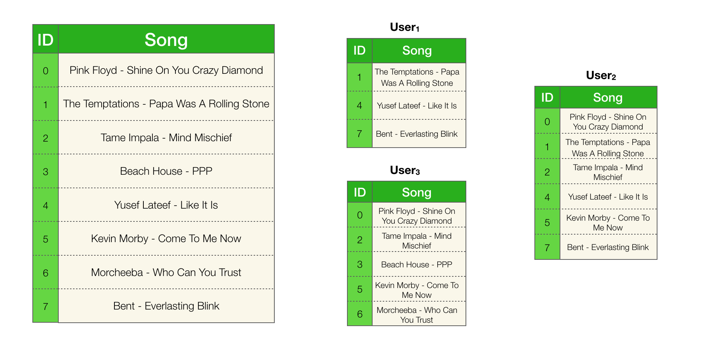
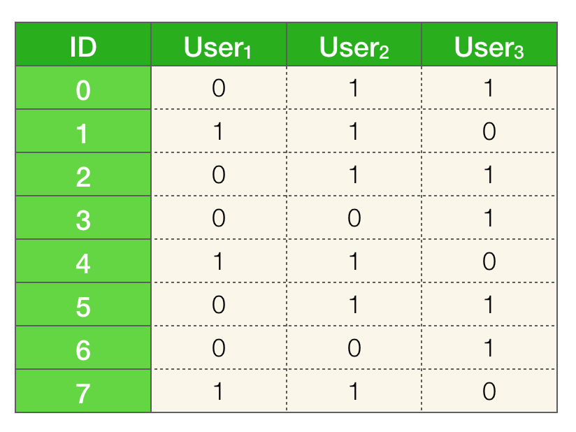

Suppose we want to cluster similar users on Spotify. With about 271 million users, if we assume that each user has about 1000 songs in their listening history we would need ~4.33 terabytes to represent the entire data. That is a lot! To make things even worse, in order to find the clusters with $$n$$ users, we need to measure the similarity between all $${n \choose 2} = \frac{n(n - 1)}{2}$$ pairs of users. With 271 million users that is an astronomical number of comparisons!

In this post, the goal will be to reduce the size of the representation of each user while preserving the similarities. This will take care of the memory issue and some of the computational burden. In the next post, we'll talk about what to do with the bigger computational problem of calculating similarities between all of the pairs of users.

<!--
Measuring similarity of objects is one of the most fundamental computations for data mining. Similarity can be used to detect plagiarism, categorize documents, recommend products to customers and there are many many more applications. There are a lot of different ways of defining similarity. In this post I'll be talking about Jaccard similarity and its' approximation. -->

### Toy example

I think working with tiny examples to build intuition is an excellent method for learning. So in that spirit, let's consider a toy example. Let's assume that we only have 3 users and we have a total of 8 songs in our dataset.



### Jaccard similarity

The goal is to cluster similar users, so we obviously need a way to measure similarities between a pair of users. We will be using Jaccard similarity. It is defined as the fraction of shared elements between two sets. In our case the sets are users' listening history. All we have to compute is how many songs each pair of users share with each other, divided by total number of songs in both users. For example the Jaccard similarity between $$\text{user}_1$$ and $$\text{user}_2$$

$$J(\text{user}_1, \text{user}_2) = \frac{|\text{user}_1 \cap \text{user}_2|}{|\text{user}_1 \cup \text{user}_2|} = \frac{|\{1, 4, 7\}|}{|\{0, 1, 2, 4, 5, 7\}|} = \frac{3}{6} = 0.5$$

Similarly for the other pairs, we have:

<center>
$$J(\text{user}_2, \text{user}_3) = \frac{3}{8} = 0.375$$
$$J(\text{user}_1, \text{user}_3) = \frac{0}{8} = 0$$
</center>

An important fact about the Jaccard similarity is that it corresponds to the probability that a randomly selected element in the union is also in the intersection. This is a crucial property of the Jaccard similarity that is central to understanding why min hashing works.

### Intuition behind the Jaccard similarity

For some people (present company included), visual explanations are easier to grasp than algebraic ones. We'll briefly shift our view from sets to Venn diagrams. Let's imagine any two users as Venn diagrams, the Jaccard similarity is the size of the intersection divided by the size of the union:


Now imagine that I'm throwing darts on the diagrams and I'm horrible at it. I'm so bad that every element on the diagrams has an equal chance of being hit. What's the chance that I throw a dart and it lands on the intersection? It would be the number of elements in the intersection divided by the total number of elements. Which is exactly what the Jaccard similarity is. This implies that the larger the similarity, the higher the probability that we land on the intersection with a random throw.


Consider another scenario. Suppose you want to know the similarity between two sets, but you can't see the diagram, you're blindfolded. However, if you throw a dart, you do get the information on where it landed. Can you make a good guess on the similarity of two sets by randomly throwing darts on it? Let's say after throwing 10 darts we know that 6 of them landed in the intersection. What would you guess that the similarity of the two sets are? Let's say after throwing 40 more darts, we know that 30 of the total 50 throws landed in the intersection. What would your guess be now? Are you more certain about your guess? Why?

Ponder about this for a little bit and keep this picture in mind throughout reading this post. This is, in essence, the basis for the MinHash algorithm.


### Approximate Jaccard similarity

In the previous paragraph, we have alluded to the fact that it's possible to approximate the Jaccard similarity between two sets. In order to see why that's true, we need to rehash some of things we've said, mathematically.

Let's take $$\text{user}_1$$ and $$\text{user}_2$$ and their union $$\text{user}_1 \cup \text{user}_2 = \{0, 1, 2, 4, 5, 7\}$$.
Some of the elements in union are also in the intersection, more specifically $$\{1, 4, 7\}$$.

Let's replace the elements with the symbols "-" and "+", denoting if an element appears in the intersection or not.

$$\{0, 1, 2, 4, 5, 7\} \rightarrow \{-, +, -, +, -, +\}$$

If every element has an equal probability of being picked, what is the probability of drawing an element that is of type "+"? It's the number of pluses divided by number of pluses and number of minuses.

$$P(\text{picking a "+"}) = \frac{\text{number of "+"}}{\text{number of "+" and "-"}}$$

The number of "+" corresponds to the number of elements in the intersection and the number of "+" and the number of "-" corresponds to the total number of elements or the size of the union. Therefore,

$$P(\text{picking a "+"}) = \frac{\text{number of "+"}}{\text{number of "+" and "-"}} = \frac{|\{1, 4, 7\}|}{|\{0, 1, 2, 4, 5, 7\}|} = J(\text{user}_1, \text{user}_2)$$

<!-- More than two sets:

If we have more than two sets some things change. Now we can have multiple intersections. Just knowing that a dart landed in an intersection is not enough, we need to keep track of all possible intersections between the sets. This might be too much of a hassle. So we're gonna change the game.

Imagine that you're at a carnival and there's a shooting game. There are n diagrams on the board, you are again blindfolded. The game is to shoot for k rounds and guess the similarities between all the sets with **some** tolerance for error. Each round consists of up to n throws of a dart. Let's imagine that each throw has a guarantee to hit at least one diagram but it could potentially hit more than one (if it lands in an intersection). After a diagram gets hit, it gets eliminated. The round is over when all of the diagrams are eliminated. The diagrams get reset after each round. As before, you get to know where the dart lands, that is, you get to know the exact element that you hit and which of the diagrams were eliminated. Can you come up with a way to guess the similarities between all of the pairs of sets? -->

<!-- Let $$X$$ be a random variable such that $$X=1$$ if we draw a plus and $$X=0$$ if we draw a minus.

$$\mathbb{E}[X] = P(X=1) \times 1 + P(X=0) \times 0 = 0.5 = J(\text{user}_{1}, \text{user}_{2})$$ -->

What this means is that we can approximate the Jaccard similarity between pairs of users. Let $$X$$ be a random variable such that $$X = 1$$ if we draw a plus and $$X = 0$$ if we draw a minus. $$X$$ is a Bernoulli random variable with $$p=J(\text{user}_{1}, \text{user}_{2})$$. In order to estimate the similarity we can estimate $$p$$. In this case we obviously know that $$p=0.5$$ since we already computed it, but let's assume that we don't know this.

If we repeat the random draw multiple times and keep track of how many times a "+" type came up versus a "-", we can estimate the parameter $$p$$ for $$X$$ by maximum likelihood estimation (MLE):

$$\hat{p}  = \frac{1}{n} \sum_{i=1}^{n} X_{i} = \hat{J}(\text{user}_{1}, \text{user}_{2})$$

Where $$X_{i}$$ are our observations and $$n$$ is the total number of draws that were made. The larger the number of draws $$n$$, the better the estimation will be.

The code below will simulate the process a 30 times and empirically compute the similarity.

```python
import numpy as np

num_trials = 30

# Union of user_1 and user_2
union = np.array([0, 1, 2, 4, 5, 7])

# Intersection of user_1 and user_2
intersection = np.array([1, 4, 7])

# Randomly pick element
draws = np.random.choice(union, num_trials)
num_intersect = np.count_nonzero(np.isin(draws, intersection))
print(num_intersect/len(draws))

```

If you run the above code you should get something that is close to $$0.5$$. Which, as expected, corresponds to the Jaccard similarity between $$\text{user}_1$$ and $$\text{user}_2$$. Play around with the variable $$\text{num_trials}$$, what happens if you set it to 1? What about 10,000?

<!-- So what does this mean? This means that we can approximate Jaccard similarity using randomness. We're going to be using this fact to come up with a way to encode the original data into a smaller representation called a *signature* such that the Jaccard similarities are well approximated.  -->


<!-- This means that this random process in expectation is the same as the Jaccard similarity. We're going to be using this fact to come up with a way to encode the original data into a smaller representation such that the Jaccard similarities are well approximated. -->

<!-- Just to restate the goal, we have a dataset $$D$$ that we want to encode in some smaller dataset $$D^{'}$$ such that $$J_{pairwise}(D) \approx J_{pairwise}(D^{'})$$. Where $$J_{pairwise}$$ is the pairwise Jaccard similarity of all users in the data. -->

<!-- This is great, but we need to compute similarities between all pairs of users not just two users. -->

### Shuffling and picking first $$ \equiv$$ Randomly picking

Before we move on, we need to understand one more thing. Randomly selecting an element from a set is the same thing as shuffling the set and picking the first element [^1]. Everything that we have said above is also true if we, instead of randomly selecting an element, shuffled the set and picked the first element. Make sure to pause here, if this doesn't make sense.

[^1]: I know shuffling a set of elements is meaningless since sets don't have order but imagine that they do :).

```python
import numpy as np

num_trials = 30

# Union of user_1 and user_2
union = np.array([0, 1, 2, 4, 5, 7])

# Intersection of user_1 and user_2
intersection = np.array([1, 4, 7])

# Shuffle and pick first element
num_intersect = 0
for i in range(num_trials):
    np.random.shuffle(union)
    if union[0] in intersection:
        num_intersect += 1
print(num_intersect/num_trials)
```
The code above implements the same process that I described before, but instead of randomly picking an element it is shuffling the elements in the union and picking the first element. If you run this you should similarly get something that is close to $$0.5$$.

### Data matrix

We have shown that it's possible to approximate Jaccard similarity for a pair of users using randomness. But our previous method had a significant issue. We still needed to have the intersection and the union set to estimate the Jaccard similarity, which kind of defeats the whole purpose. We need a way to approximate the similarities without having to compute these sets. We also need to approximate the similarities for all pairs of users, not just a given pair. In order to do that, we're going to switch our view of the data from sets to a matrix.



The columns represent the users and the rows represent the songs. A given user has a $$1$$ in a particular row if they have the song that represents that row in their listening history [^2].

[^2]: Obviously, we wouldn't store the data in this form in practice, since it's extremely wasteful. But seeing the data as a matrix will be a helpful for conceptualizing the methods that we're gonna discuss.

### Min Hashing

To reiterate the goal, we want to encode the data into a smaller representation such that the Jaccard similarities are preserved. In more "mathy" terms, we have a data matrix $$D$$ that we want to encode in some smaller matrix $$\hat{D}$$ called the signature matrix, such that $$J_{pairwise}(D) \approx \hat{J}_{pairwise}(\hat{D})$$ [^4].

[^4]: $$J_{pairwise}$$ is a function that produces a matrix which represents all pairwise similarities of the users in the data.

The first algorithm I will be describing is not really practical but it's a good way to introduce the actual algorithm called MinHash. The whole procedure can be summarized in a sentence: shuffle the rows of the data matrix and for each user (column) store the ID of the first non-zero element. That's it!

**naive-minhashing**
```
for k iterations
  shuffle rows
  for each column
    store the ID of first non-zero element into the signature matrix
```
Let's go through one iteration of this algorithm:


To compute the Jaccard similarities between the users we do an element-wise comparison of the signatures. Let $$h$$ be the function that finds and returns the index of the first non-zero element. Then we have:

<center>
$$h(\text{user}_{1}) = 7$$
$$h(\text{user}_{2}) = 0$$
$$h(\text{user}_{3}) = 0$$
</center>

And the Jaccard similarities are estimated as  [^3]:

$$\hat{J}(\text{user}_{i}, \text{user}_{j}) = \unicode{x1D7D9}[h(\text{user}_{i}) = h(\text{user}_{j})]$$

[^3]: The strange looking one ($$\unicode{x1D7D9}$$) is called the indicator function. It outputs a 1 if the expression inside the brackets evaluates to true, otherwise the output is a 0.

**Why would this work?**

The probability that $$h(\text{user}_{i})$$ and $$h(\text{user}_{j})$$ are the same is exactly $$J(\text{user}_{i}, \text{user}_{j})$$. That is, we're claiming that $$P(h(\text{user}_{i}) = h(\text{user}_{j})) = J(\text{user}_{i}, \text{user}_{j})$$. What this means is that, if a pair of users have a high similarity, there is a high probability they will have the same value for $$h$$. Do you remember throwing darts at the diagrams? The intuition is the same here.

To make sense of why this is true, let's again focus on a particular pair $$\text{user}_{1}$$ and $$\text{user}_{2}$$. I've highlighted the relevant rows using the same definition for the symbols "+" and "-" as before. We have an additional symbol called "null", these correspond to elements that are in neither of the selected users. The "null" type rows can be ignored since they do not contribute to the similarity.


If we shuffled the rows what is the probability that the first **non**-"null" row is of type "+"? In other words, after shuffling the rows, if we proceeded from top to bottom while skipping over all "null" rows, what is the probability of seeing a "+" before seeing a "-"?

If we think back to our example with sets, this question should be easy to answer. All we have to realize is that, encountering a "+" before a "-" is the exact same thing randomly drawing a "+" in the union. Which we know has a probability that is equal to the Jaccard similarity.

<!-- [^3]: The only difference is that we're using shuffling instead of randomly picking, which we've concluded is the exact same thing. -->

$$P(\text{seeing a "+" before "-"})  = \frac{\text{number of "+"}}{\text{number of "+" and "-"}} = J(\text{user}_{1}, \text{user}_{2})$$

If the first row is of type "+" that also means that $$h(\text{user}_{1}) = h(\text{user}_{2})$$, so the above expression is equivalent to saying:

$$P(h(\text{user}_{1}) = h(\text{user}_{2})) = J(\text{user}_{1}, \text{user}_{2})$$

The same argument holds for any pair of users.

<!-- Remember, throwing darts at the diagrams? That's exactly what we're doing here. You can think of this process as throwing a dart on the diagram and then checking if it landed in an intersection. -->

Going back to our example, we have pairs ($$\text{user}_1$$, $$\text{user}_2$$) and ($$\text{user}_1$$, $$\text{user}_3$$) having similarity zero since their signatures do not match. The similarity for ($$\text{user}_2$$, $$\text{user}_3$$) will be 1 since both have the same signature.


As you can see it's a *little* off. This is because we're only using a single signature to measure the similarities. We've mentioned before that the more random simulations we run the better the approximation will be. In order to have a better approximation, we should run a few more iterations of this process. This would result in a larger signature matrix.

The animation below shows the process of going through 3 iterations of this algorithm:


Computing the Jaccard similarities with the larger signature matrix:


That's much better. It's still not exactly the same but it's not too far off. We've managed to reduce the number of rows of the matrix from 8 to 3 while preserving the pairwise Jaccard similarities up to some error. To achieve a better accuracy, we could construct a larger signature matrix, but obviously we would be trading off the size of the representation.

If you want to play around with this algorithm, here's an implementation in Python using Numpy:

```python
import numpy as np

def min_hashing_naive(data, num_iter):
    num_users = data.shape[1]
    sig = np.zeros(shape=(num_iter, num_users), dtype=int)
    for i in range(num_iter):
        np.random.shuffle(data)
        for j in range(num_users):
            c = data[:, j]
            if np.any(c != 0):
                min_hash = np.where(c == 1)[0][0]
                sig[i, j] = min_hash
    return sig
```

### MinHash Algorithm

Shuffling the rows of the data matrix can be slow, especially if the matrix is large. We would like to avoid doing this. What we're going to do instead is *implicitly* shuffle the rows by generating a permutation on the indices of the rows. In order to do this, we're going to introduce hash functions.

A hash function $$h$$ will map every index in the row to some unique integer. It's not a requirement for the range of the hash values to be the same as the indices, but let's assume for the sake of this example that it is. Then you can think of these permutations as where the row would have landed if we actually randomly shuffled the rows. For example with 8 rows, the hash function could map them to:

$$[0, 1, 2, 3, 4, 5, 6, 7] \rightarrow [4, 1, 5, 6, 0, 2, 3, 7]$$

To simulate multiple iterations of shuffling, we're going to apply multiple hash functions to every index.

**Recipe for generating hash functions**

Pick a prime number $$p \ge m$$ where $$m$$ is the number of rows in the dataset. Then each hash function $$h_{i}$$ can be defined as:

$$h_{i}(x) = (a_{i}x + b_{i}) \mod p$$

Where $$a_{i}, b_{i}$$ are random integers in the range $$[1, p)$$ and $$[0, p)$$, respectively. The input $$x$$ to the function is the index of the row. To generate a hash function, all we have to do is pick the parameters $$a$$ and $$b$$.

For example, let's define three hash functions: $$h_{1}, h_{2}, h_{3}$$

<center>
$$h_{1}(x) = 7x \mod 11$$
$$h_{2}(x) = (x + 5) \mod 11$$
$$h_{3}(x) = (3x + 1) \mod 11$$
</center>

We'll be applying these hash functions to the rows of our toy dataset. Since the number of rows $$m = 8$$ is not a prime number we chose $$p = 11$$ (the closest prime to $$m$$). The reason for doing this is because we don't want to have collisions, that is we don't want more than one row to map to the same value for a given hash function.

As I've mentioned before, the values of the hash function need not be in the same range as the indices. As long as each index is mapped to a unique value, the range of the values actually makes no difference. If this doesn't make sense to you, let's unpack the example we have. In this case, our hash functions will produce values in the range $$[0, 10]$$. We can imagine expanding our dataset with a bunch of "null" type rows so that we have $$m=p=11$$ rows. We know that the "null" rows don't change the probability of two users having the same signature, therefore our estimates should be be unaffected.


<!-- But what this means is that our hash functions will produce values in the range $$[0, 10]$$, which is larger than your set of indices. This will actually end up not making any difference. To see why we can imagine expanding our dataset with a bunch of "null" type rows so that we have $$m=11$$. We know that the "null" rows don't change the probability of two users having the same signature, therefore having a range bigger than the actual is not going to change anything. -->


Now that we have the hash functions, we're finally ready for the MinHash algorithm:

**MinHash**
```
Initialize all elements in the signature matrix sig to infinity
for each row r in the dataset
  Compute h_{i}(r) for all hash functions h_{1}, h_{2}, ..., h_{k}
  for each non-zero column c in the row r
    if sig(i, c) > h_{i}(r)
      update sig(i, c) = h_{i}(r)
```

When the algorithm terminates the signature matrix should contain all the minimum hash values for each user and hash function pair. The video below is an animation that simulates the algorithm over the toy dataset. Watching it should hopefully clear up any questions you have about how or why the algorithm works.

<center> <iframe width="560" height="315" src="https://www.youtube.com/embed/wV5v153Lj5w" frameborder="0" allow="accelerometer; autoplay; encrypted-media; gyroscope; picture-in-picture" allowfullscreen></iframe> </center>

---

If you have any questions or you see any mistakes, please feel free to use the comment section below.
